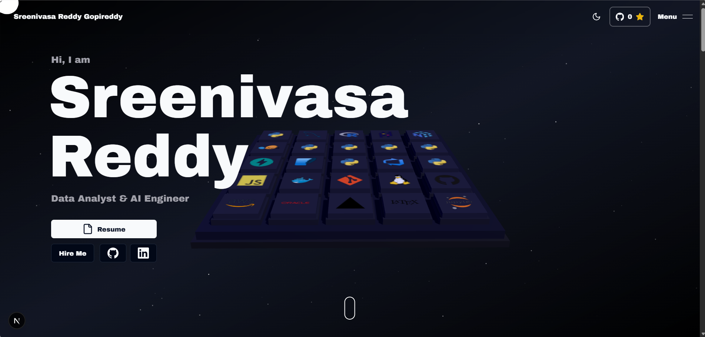

# Sreenivasa Reddy Gopireddy — 3D Portfolio

An interactive developer portfolio built with Next.js, featuring a custom 3D skill keyboard, smooth animations, and a space-themed aesthetic — designed to showcase data analytics and AI engineering work.

[](https://vercel.com/new/clone?repository-url=https://github.com/sreenugopireddy/3d-portfolio)



**Live →** [sreenu-gopireddy.vercel.app](https://sreenu-gopireddy.vercel.app)

---

## Features

- **Interactive 3D Keyboard** — Custom Spline keyboard where each keycap represents a data/AI skill, with hover and press interactions
- **Smooth Animations** — GSAP + Framer Motion powered scroll, hover, and reveal transitions
- **Space Theme** — Floating particles on a dark canvas
- **Light & Dark Mode** — Full theme support with disclaimer toasts
- **Responsive** — Works across all screen sizes
- **Contact Form** — Email delivery via Resend
- **Publications Page** — Showcases research and technical writing

---

## Tech Stack

| Layer | Technologies |
|---|---|
| **Framework** | Next.js 16, React 19, TypeScript |
| **Styling** | Tailwind CSS, Shadcn UI |
| **Animation** | GSAP, Framer Motion |
| **3D** | Spline Runtime |
| **Email** | Resend |
| **Misc** | Lenis (smooth scroll), Zod, next-themes |

---

## Getting Started

### Prerequisites

- Node.js (v18+)
- npm or yarn

### Installation

1. **Clone the repository:**

    ```bash
    git clone https://github.com/sreenugopireddy/3d-portfolio.git
    cd 3d-portfolio
    ```

2. **Install dependencies:**

    ```bash
    npm install
    ```

3. **Set up environment variables:**

    Create a `.env.local` file in the root:

    ```bash
    RESEND_API_KEY=your_resend_api_key_here
    ```

    | Variable | Required | Description |
    |---|---|---|
    | `RESEND_API_KEY` | Yes | API key from [Resend](https://resend.com) for the contact form |

4. **Run the development server:**

    ```bash
    npm run dev
    ```

5. Open [http://localhost:3000](http://localhost:3000)

---

## Project Structure

```
3d-portfolio/
├── public/
│   └── assets/
│       ├── nav-link-previews/     # Nav hover preview images
│       └── projects-screenshots/  # Project card screenshots
├── src/
│   ├── app/
│   │   └── publications/          # Publications page
│   ├── components/
│   │   ├── header/                # Nav and header
│   │   ├── sections/              # Page sections (hero, skills, experience, etc.)
│   │   └── footer/                # Footer
│   └── data/
│       ├── config.ts              # Personal info, social links, SEO
│       ├── constants.ts           # Skills and experience data
│       └── projects.tsx           # Projects data
```

---

## Customization

All personal info lives in `src/data/config.ts`:

```ts
const config = {
  title: "Sreenivasa Reddy | Data Analyst & AI Engineer",
  author: "Sreenivasa Reddy Gopireddy",
  email: "sreenugopireddy24@gmail.com",
  site: "https://sreenu-gopireddy.vercel.app",
  githubUsername: "sreenugopireddy",
  githubRepo: "3d-portfolio",
  social: {
    linkedin: "https://www.linkedin.com/in/sreenu-gopireddy/",
    github: "https://github.com/sreenugopireddy",
  },
};
```

Other files to update when adding new content:

| File | What to change |
|---|---|
| `src/data/projects.tsx` | Projects, screenshots, descriptions, tech stacks |
| `src/data/constants.ts` | Skills list and work experience |
| `src/app/publications/page.tsx` | Research publications |
| `public/assets/nav-link-previews/` | Nav hover preview images |
| `public/assets/projects-screenshots/` | Project card screenshots |

---

## Sections

| Section | Description |
|---|---|
| **Hero** | Name, title, resume download, social links |
| **Skills** | Interactive 3D keyboard with 25 data/AI skills |
| **Experience** | Microsoft Elevate (AICTE) and Edunet Foundation internships |
| **Certifications** | AWS, Oracle Cloud, and other certifications |
| **Projects** | Pneumonia Detection, Healthcare RAG, Financial Anomaly Detection, Smart Grid Forecasting, AI Data Analyst Agent, Power BI Dashboard |
| **Contact** | Contact form powered by Resend |
| **Publications** | Research writing on ReadyTensor |

---

## Deployment

This site is deployed on **Vercel**.

1. Push your code to GitHub
2. Connect the repository to [Vercel](https://vercel.com)
3. Add `RESEND_API_KEY` in the Vercel environment variables dashboard
4. Vercel deploys automatically on every push to `main`

---

## Credits

Built on top of the open source [3D Portfolio](https://github.com/Naresh-Khatri/3d-portfolio) template by [Naresh Khatri](https://github.com/Naresh-Khatri). Customized and extended for data analytics and AI engineering work.

---

## Author

**Sreenivasa Reddy Gopireddy**  
[sreenugopireddy24@gmail.com](mailto:sreenugopireddy24@gmail.com) · [LinkedIn](https://www.linkedin.com/in/sreenu-gopireddy/) · [GitHub](https://github.com/sreenugopireddy)
